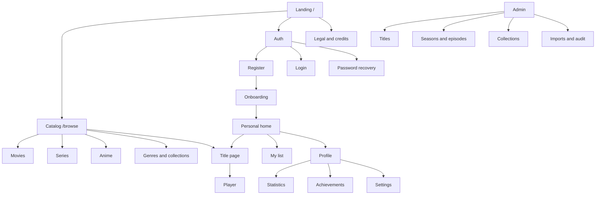

# Фаза 1 — продуктова основа

Статус: **готово до погодження**  
Версія: 0.1  
Дата: 2026-08-06

Цей документ перетворює загальну ідею з `plan.md` на конкретне завдання для дизайну та розробки. Рішення зі статусом «тимчасове» можна змінити без перебудови архітектури.

---

## 1. Product brief

### Робоча назва

**Frame** — тимчасова назва для макетів і коду. Перед купівлею домену необхідно окремо перевірити торгові марки, пошукову впізнаваність, соцмережі та доступність доменів.

### Короткий опис

Frame — україномовна платформа, де користувач знаходить легально доступні фільми, серіали й аніме, продовжує перегляд з потрібного моменту, веде власні списки та бачить зрозумілу статистику без агресивної гейміфікації.

### Основна цінність

> Увесь твій перегляд — каталог, прогрес, списки й статистика — в одному спокійному кінематографічному інтерфейсі.

### Ціль першого запуску

- регіон: Україна;
- основна мова інтерфейсу: українська;
- додаткова архітектурна готовність: англійська;
- платформи: адаптивний web, насамперед mobile та desktop;
- доступ на beta: безкоштовний;
- контент на beta: open-license/demo HLS і трейлери, на які є право показу;
- production-каталог: лише власний або ліцензований контент;
- метадані: власні записи або TMDB API з атрибуцією та дотриманням умов використання.

### Продуктові принципи

1. **Контент попереду інтерфейсу.** Постери та кадри є головним візуальним акцентом.
2. **Продовжити легко.** Користувач має повернутися до відео максимум за два кліки.
3. **Прозора персоналізація.** Пояснювати, чому рекомендовано тайтл.
4. **Спокійна гейміфікація.** Стріки й нагороди підтримують звичку, але не стимулюють шкідливий binge-watching.
5. **Приватність за замовчуванням.** Історія й активність не стають публічними без явної дії.
6. **Доступність — частина дизайну.** Keyboard, screen reader, контраст, reduced motion і субтитри плануються одразу.
7. **Жодного фальшивого функціоналу.** Недоступний контент має чесний статус, а не биту кнопку «Дивитися».

### North-star сценарій

Користувач відкриває сайт, знаходить цікавий тайтл, починає або продовжує перегляд, а після повернення одразу бачить актуальний прогрес і наступний епізод.

### Показники beta

- успішне завершення onboarding: ≥ 70%;
- користувач знаходить і відкриває тайтл: ≥ 60% активних сесій;
- старт demo-перегляду після відкриття тайтлу: ≥ 35%;
- коректне відновлення прогресу: ≥ 99% перевірених сесій;
- crash-free sessions: ≥ 99.5%;
- mobile LCP для landing: < 2.5 s;
- повернення beta-користувача протягом 7 днів — вимірювати як базову лінію, не задавати вигадану ціль до перших даних.

---

## 2. Аудиторія

### Persona A — «Дивлюся ввечері»

- 20–35 років, частіше телефон або ноутбук;
- хоче швидко обрати щось на вечір;
- не любить перевантажені каталоги;
- потребує «Продовжити перегляд», коротких описів, фільтрів за жанром і тривалістю.

### Persona B — «Стежу за серіалами»

- дивиться кілька серіалів/аніме паралельно;
- важливо знати, де зупинився і чи вийшла нова серія;
- потребує сезони, епізоди, прогрес, сповіщення та улюблену озвучку.

### Persona C — «Веду власний каталог»

- ставить оцінки, збирає списки, любить статистику;
- потребує історію, ratings, custom lists, календар активності й контроль публічності.

### Persona D — «Редактор каталогу»

- додає й перевіряє тайтли, сезони, епізоди та медіа;
- потребує draft/publish workflow, імпорт метаданих, preview і audit log;
- не повинен мати повний системний доступ адміністратора.

---

## 3. Jobs to be done

1. Коли я не знаю, що подивитися, я хочу швидко звузити каталог, щоб не витратити вечір на вибір.
2. Коли я повертаюся до серіалу, я хочу одразу продовжити з правильної серії та секунди.
3. Коли виходить новий епізод, я хочу побачити його без пошуку по всьому каталогу.
4. Коли я знаходжу цікавий тайтл, я хочу зберегти його у зрозумілий список.
5. Коли я завершую перегляд, я хочу оцінити його та побачити оновлену статистику.
6. Коли я налаштовую профіль, я хочу сам вирішувати, що бачать інші.
7. Коли я керую каталогом, я хочу підготувати запис як draft і перевірити його до публікації.

---

## 4. MVP та відкладені можливості

### Must have

- landing, каталог і сторінка тайтлу;
- email/password auth, відновлення пароля;
- onboarding;
- фільми, серіали, аніме, жанри, сезони й епізоди;
- пошук, фільтри, сортування;
- HLS-плеєр для легальних demo assets;
- прогрес, history, continue watching;
- watchlist, favorites, rating 1–10;
- профіль, налаштування, статистика;
- login streak, watch streak і базові achievements;
- admin CRUD, draft/publish;
- RLS, audit, monitoring, legal/credits.

### Should have

- custom lists;
- new episode notifications;
- ручне mark watched для епізоду/сезону;
- skip intro/outro;
- public profile з окремими privacy-перемикачами;
- прості персональні рекомендації.

### Could have

- OAuth Google/Apple;
- кілька профілів в одному акаунті;
- reviews;
- дитячий профіль і PIN;
- PWA install;
- share-картки списків.

### Won't have у першому релізі

- платежі;
- watch party;
- чат;
- завантаження відео користувачами;
- офлайн-завантаження;
- ML-рекомендації;
- мобільні/TV native apps.

---

## 5. User stories та acceptance criteria

### Реєстрація

**Як новий користувач, я хочу створити акаунт, щоб зберігати свій прогрес.**

- email валідовано;
- пароль має видимі вимоги;
- помилки перекладено зрозумілою мовою;
- після підтвердження email відкривається onboarding;
- повторна реєстрація не розкриває зайвих даних про існування акаунта.

### Onboarding

**Як новий користувач, я хочу швидко налаштувати рекомендації.**

- username перевіряється на доступність;
- timezone визначається автоматично, але його можна змінити;
- вибір жанрів/тайтлів можна пропустити;
- після завершення користувач бачить персоналізовану або популярну головну.

### Пошук і фільтри

**Як глядач, я хочу знайти контент за назвою або параметрами.**

- пошук знаходить основну, оригінальну й альтернативну назву;
- фільтри зберігаються в URL;
- повернення Back відновлює позицію і фільтри;
- empty state пропонує прибрати частину фільтрів.

### Продовження перегляду

**Як глядач, я хочу повернутися на останню позицію.**

- прогрес зберігається під час перегляду, pause і виходу;
- після reload позиція відновлюється;
- старий heartbeat не переписує новіший прогрес;
- після 90% епізод вважається завершеним;
- завершений епізод пропонує наступний.

### Списки

**Як глядач, я хочу зберегти тайтл на потім.**

- додавання/видалення працює з картки та title page;
- optimistic UI відкатується при помилці;
- дублікати неможливі;
- приватний список недоступний іншому користувачу.

### Стрік

**Як користувач, я хочу бачити послідовність активних днів.**

- день зараховується один раз за локальною датою профілю;
- повторні запити не збільшують стрік;
- пропущений день скидає current count до 1 при наступному візиті;
- longest count не зменшується;
- нагорода видається один раз;
- login streak та watch streak показані окремо.

### Редактор каталогу

**Як редактор, я хочу опублікувати перевірений тайтл.**

- новий тайтл створюється як draft;
- обов'язкові поля перевіряються до publish;
- preview доступний редактору;
- кожна зміна зберігається в audit log;
- звичайний користувач не бачить draft.

---

## 6. Sitemap



---

## 7. П'ять ключових user flows

### Flow 1 — перший вхід

```text
Landing → Register → Email confirmation → Onboarding
→ вибір username/timezone/жанрів → Home
```

Критичні помилки: недоставлений лист, зайнятий username, втрачена сесія після redirect. Для кожної потрібен retry або зрозумілий вихід.

### Flow 2 — пошук і початок перегляду

```text
Home/Catalog → Search або filters → Title page
→ вибір епізоду/мови → Watch → playback started
```

Кнопка «Дивитися» неактивна з поясненням, якщо asset недоступний у регіоні або ще не опублікований.

### Flow 3 — повернення до серіалу

```text
Login → Home → Continue watching → Watch at saved position
→ completion → countdown → Next episode
```

Ціль: максимум два кліки від Home до відновленого відео.

### Flow 4 — список та оцінка

```text
Title/Card → Add to watchlist → My list → Watch
→ Finish → Rate 1–10 → Stats and recommendations updated
```

### Flow 5 — щоденна активність і нагорода

```text
Authenticated app open → register_daily_activity()
→ idempotent streak update → threshold check
→ optional achievement toast → Profile/Achievements
```

Сервер визначає локальну дату з IANA timezone профілю. Браузер не передає число стріку.

### Додатковий admin flow

```text
Admin → New title/import metadata → Draft
→ add seasons/episodes/assets → Preview → Validate → Publish
→ Audit log
```

---

## 8. Wireframes

Wireframes описують ієрархію, а не фінальний вигляд.

### Landing — desktop

```text
┌──────────────────────────────────────────────────────────────┐
│ LOGO     Каталог  Можливості  FAQ      Тема  Увійти  [CTA] │
├──────────────────────────────────────────────────────────────┤
│                                                              │
│  Один простір для всіх історій        [poster composition]  │
│  Коротке пояснення продукту                                  │
│  [Почати дивитися] [Переглянути каталог]                     │
│                                                              │
├──────────────────────────────────────────────────────────────┤
│ Популярне зараз       [Фільми] [Серіали] [Аніме]             │
│ [poster] [poster] [poster] [poster] [poster]                  │
├──────────────────────────────────────────────────────────────┤
│ Continue watching demo      │  Profile stats demo             │
├──────────────────────────────────────────────────────────────┤
│ Функції: списки │ прогрес │ субтитри │ статистика             │
├──────────────────────────────────────────────────────────────┤
│ Пристрої                    │ FAQ                              │
├──────────────────────────────────────────────────────────────┤
│ Footer: legal · credits · contacts                            │
└──────────────────────────────────────────────────────────────┘
```

### Home — desktop

```text
┌──────────────────────────────────────────────────────────────┐
│ LOGO  Home  Фільми  Серіали  Аніме    Search   Avatar       │
├──────────────────────────────────────────────────────────────┤
│ HERO BACKDROP                                                │
│ Назва · metadata · короткий опис                             │
│ [Продовжити/Дивитися] [До списку]                            │
├──────────────────────────────────────────────────────────────┤
│ Продовжити перегляд     [card==progress] [card] [card]        │
│ Нові епізоди            [card] [card] [card] [card]           │
│ Мій список              [card] [card] [card] [card]           │
│ Рекомендовано           [card] [card] [card] [card]           │
└──────────────────────────────────────────────────────────────┘
```

### Catalog — desktop/mobile

```text
Desktop                           Mobile
┌──────────┬───────────────────┐  ┌──────────────────────┐
│ Filters  │ Tabs + sort       │  │ Tabs  [Filter] [Sort]│
│ genre    │ [poster grid]     │  │ [poster] [poster]    │
│ year     │ [poster grid]     │  │ [poster] [poster]    │
│ country  │ [pagination]      │  │ load more            │
└──────────┴───────────────────┘  └──────────────────────┘
```

### Title — desktop

```text
┌────────────────────── BACKDROP ──────────────────────────────┐
│ [poster]  Назва                                              │
│           metadata · genres · rating                         │
│           synopsis                                           │
│           [Дивитися] [+ Список] [Оцінити]                    │
└──────────────────────────────────────────────────────────────┘
│ [Про тайтл] [Епізоди] [Схожі]                               │
│ Season selector                                               │
│ episode thumbnail | title | duration | progress | play        │
│ episode thumbnail | title | duration | progress | play        │
└──────────────────────────────────────────────────────────────┘
```

### Watch — desktop

```text
┌──────────────────────────────────────────────────────────────┐
│ ← Назва · S01 E03                           Episodes drawer  │
│                                                              │
│                        VIDEO                                 │
│                                                              │
│ ▶ ───────────────●────────────  24:18 / 48:10  CC  ⚙  ⛶     │
└──────────────────────────────────────────────────────────────┘
```

Controls зникають лише після короткої бездіяльності; focus/hover повертає їх. На mobile tap відкриває controls, swipe gestures не є єдиним способом керування.

### Profile — mobile

```text
┌──────────────────────────┐
│       cover/banner       │
│  avatar  name   [Edit]   │
│  @username · badge       │
│  bio                     │
│ [Overview][Stats][Awards]│
│ Current streak    12 🔥  │
│ [activity heatmap]       │
│ Movies  Episodes  Hours  │
│ Featured titles          │
├──────────────────────────┤
│ Home Search List Profile │
└──────────────────────────┘
```

---

## 9. Moodboard словами

### Відчуття

- тиха кінозала перед початком сеансу;
- друкований культурний журнал;
- тепле локальне світло, темний графіт і натуральні відтінки;
- упевнена типографіка без футуристичного «техно» стилю;
- інтерфейс спокійний, контент емоційний.

### Палітра-кандидат

```text
Dark background   #111315
Dark surface      #191C1F
Raised surface    #22262A
Primary text      #F2F0EB
Muted text        #AAA7A0
Border            #303438
Accent amber      #D69A45
Accent hover      #E3AC61
Success           #5D9B76
Danger            #C96767

Light background  #F5F2EC
Light surface     #FFFCF7
Light text        #191A1C
```

Це стартові значення, які потрібно перевірити на контраст і на реальних постерах.

### Типографіка

- UI/body: Inter, Manrope або локально розміщений open-source sans;
- display: виразний, але читабельний serif або humanist sans тільки для hero/h1;
- не використовувати більше двох сімейств;
- tabular numbers для таймерів плеєра та статистики.

### Зображення

- постери 2:3;
- backdrop 16:9 або ширше;
- hero має затемнення для читабельності, але не кольоровий neon glow;
- thumbnails епізодів 16:9;
- avatars 1:1;
- не змішувати фотографії різної обробки у декоративні колажі без єдиного color grade.

### Рух

- hover card: легкий підйом або масштаб до 1.02;
- drawers/modals: 180–240 ms;
- route transition не потрібен у MVP;
- ніяких постійно пульсуючих елементів;
- reduced motion прибирає transform і parallax.

### Заборонені патерни

- синьо-фіолетовий neon glow навколо кожної картки;
- скляні панелі поверх складних постерів;
- градієнтний текст у кожному заголовку;
- надто великі pill-кнопки;
- декоративні 3D-сфери та випадкові AI-зображення;
- приховані hover-only дії без mobile/keyboard альтернативи.

---

## 10. Контентна модель beta

### Безпечний варіант

1. 12–20 demo titles з явно дозволеними постерами/зображеннями.
2. 3–5 open-license/demo HLS videos для тестування плеєра.
3. Решта записів каталогу може мати лише трейлер або статус «Інформація про тайтл», якщо немає права показу повного відео.
4. У `credits` показати джерело метаданих і потрібну атрибуцію.
5. До production скласти реєстр прав: title, territory, languages, start/end dates, allowed devices, download/DRM requirements.

### Заборонено

- вставляти iframe з випадкових streaming-сайтів;
- парсити чужі відеопосилання;
- називати трейлер повним фільмом;
- робити відеобакет публічним;
- видавати постійний прямий URL захищеного asset.

---

## 11. Рішення фази 1

| Питання            | Тимчасове рішення                  | Статус                      |
| ------------------ | ---------------------------------- | --------------------------- |
| Назва              | Frame                              | потребує фінального вибору  |
| Перший ринок       | Україна                            | прийнято для MVP            |
| UI-мова            | українська                         | прийнято для MVP            |
| Бізнес-модель beta | безкоштовна закрита/відкрита beta  | прийнято                    |
| Відео beta         | open-license/demo assets           | прийнято                    |
| Production video   | ліцензований каталог, HLS/DASH     | обов'язкова умова           |
| Метадані           | власні + можливий TMDB import      | прийнято з атрибуцією       |
| Візуальний напрям  | editorial cinema, graphite + amber | готово до макета            |
| Профілі            | один profile на account у MVP      | прийнято, схема розширювана |
| Соціальні функції  | після MVP                          | прийнято                    |
| Платежі            | після MVP                          | прийнято                    |

---

## 12. Відкриті рішення перед production

Ці питання не блокують створення frontend foundation і beta:

1. Фінальна назва та домен.
2. Конкретний ліцензійний партнер/правовласник.
3. Безкоштовний, рекламний або subscription запуск.
4. Вимоги до DRM і геоблокування.
5. Чи потрібні кілька профілів в одному акаунті у першій платній версії.
6. Чи будуть коментарі/reviews — це додає значний moderation scope.

---

## 13. Критерій завершення фази 1

- [x] Product brief зафіксований.
- [x] MVP і non-MVP розділені.
- [x] Personas та Jobs to be done описані.
- [x] Основні user stories мають acceptance criteria.
- [x] Sitemap створений.
- [x] П'ять ключових user flows створені.
- [x] Wireframes ключових сторінок створені.
- [x] Moodboard і стартові design tokens описані.
- [x] Безпечна beta-модель контенту визначена.
- [ ] Робочі рішення погоджені власником продукту.
- [ ] Фінальна назва й домен обрані — не блокує фазу 2.

Після погодження або безпечного прийняття тимчасових рішень можна переходити до фази 2: ініціалізація React/TypeScript проєкту.
